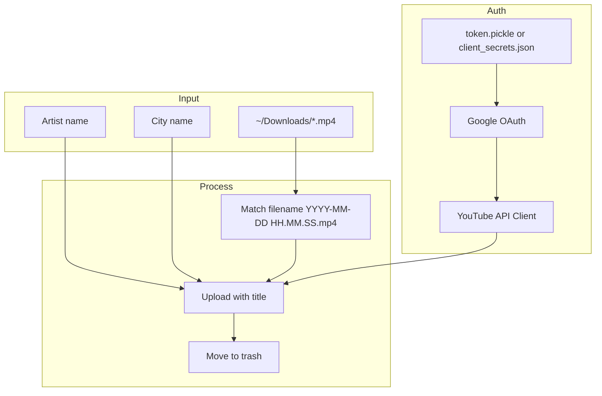

# Architecture

## Folder Structure

```
youtube-uploader/
├── app.py              # Main application logic
├── requirements.txt    # Python dependencies
├── README.md           # User-facing setup and usage
├── .gitignore          # Excludes client_secrets.json, token.pickle, venv/
└── docs/               # Project documentation
```

## Core Modules

The project is a single module (`app.py`) with four responsibilities:

| Component | Responsibility |
|-----------|----------------|
| `get_authenticated_service()` | OAuth flow, token persistence, YouTube API client build |
| `upload_video()` | Resumable upload, progress reporting, video metadata |
| `move_to_trash()` | Post-upload cleanup via `gio trash` |
| `main()` | Discovery, user input, orchestration |

## Data Flow



## Execution Flow

1. **Discovery** — `Path.home() / "Downloads"` scanned for `*.mp4`
2. **User input** — Artist and city prompted via `input()`
3. **Auth** — `get_authenticated_service()` loads or refreshes OAuth credentials
4. **Filter** — Regex `(\d{4})-(\d{2})-(\d{2})\s+(\d{2})\.(\d{2})\.(\d{2})\.mp4` filters valid filenames
5. **Upload loop** — Each matching file uploaded, then moved to trash on success

## Design Patterns

- **Script-style entrypoint** — `if __name__ == "__main__": main()`
- **Token persistence** — Pickled credentials in `token.pickle` for reuse
- **Resumable upload** — `MediaFileUpload(..., resumable=True)` with chunk progress

## External Integrations

| Integration | Purpose |
|-------------|---------|
| YouTube Data API v3 | Video insert (`videos().insert`) |
| Google OAuth 2.0 | `https://www.googleapis.com/auth/youtube.upload` |
| `gio trash` | Ubuntu/GNOME trash (via `os.system`) |
